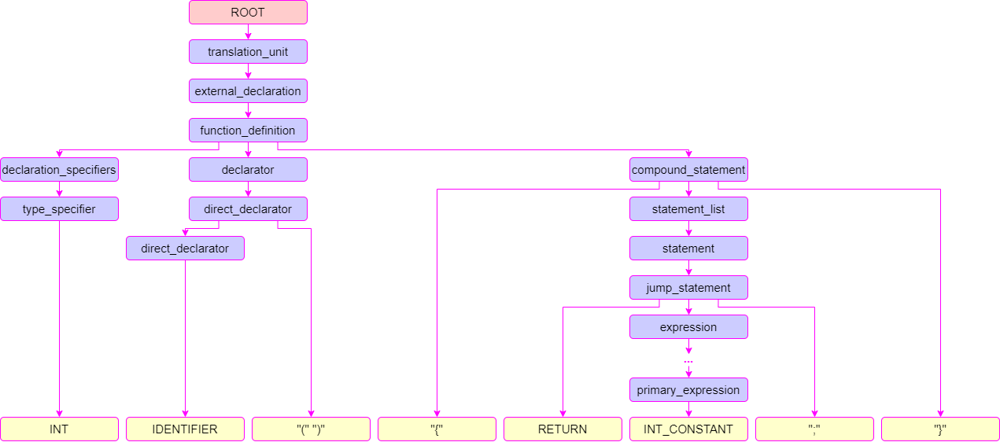

Basic compiler
==============

You are provided with a basic compiler that can lex, parse, and generate code for only the following program:
```
int f() {
    return 5;
}
```

The compiler is able to traverse the following AST related to the above program. In order to expand its capabilities, you should develop the parser and the corresponding code generation at the same time -- you are advised not to fully implement one before the other.




The lexer and parser are loosely based on the "official" grammar covered [here](https://www.lysator.liu.se/c/ANSI-C-grammar-l.html) and [here](https://www.lysator.liu.se/c/ANSI-C-grammar-y.html) respectively. While they should suffice for a significant portions of features, you might need to improve them to implement the more advanced ones. If you find the grammar too complicated to understand, it is also perfectly fine to create your own simple grammar and build upon it as you add more features.

Two versions of the grammar have been provided:

- [parser.y](../src/parser.y) contains a stripped down version of the grammar which contains only the elements from the full grammar that are necessary to parse the program above. **This is the grammar used when you run ./scripts/test.py**.
- [parser_full.y.example](../src/parser_full.y.example) is the same as `parser.y` but also contains the rest of the C90 grammar not used in the above program. Once you understand how the stripped version works, you have two options: you can extend `parser.y` at your own pace and add pieces of the C90 grammar to it as you implement them; alternatively, you may paste the contents of `parser_full.y.example` into `parser.y` allowing you to parse everything but this may make the file much harder to navigate.

Note that you don't have to use any of the provided grammar examples (or even flex and bison) if you are comfortable with doing something else. However, be warned that TAs will likely only be able to provided limited support for such alternatives.

You can follow the patterns introduced for the code generation part of the basic compiler, but you might find adjusting them to your needs is better in the long run.
