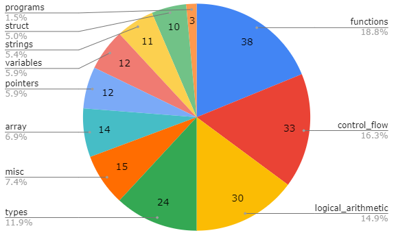

Main coursework: A compiler for the C language
==============================================

Your program should read C source code from a file, and write corresponding RISC-V assembly to another file.

Environment
-----------
[How to set up your environment?](./environment_guide.md)

Developing your compiler
------------------------

If you wish to use C++, then a basic framework for building your compiler has been provided. You are strongly recommended to check out its structure [here](./basic_compiler.md).

Source files can be found in the [./src](../src) folder and header files can be found in the [./include](../include) folder.

You can test your compiler by running
[`scripts/test.py`](../scripts/test.py) from the top of this repo; the
output should look as follows (note: the progress bar and results will be coloured):

```console
> user@host:langproc-cw# scripts/test.py
>
make: Entering directory '/home/saturn691/projects/university/iac/langproc-cw'
make: 'bin/c_compiler' is up to date.
make: Leaving directory '/home/saturn691/projects/university/iac/langproc-cw'
Running Tests [################################################################]
Pass:  1 | Fail: 85 | Remaining:  0
See logs for more details (use -v for verbose output).

>> Test Summary: 1 Passed, 85 Failed
```

Full usage guide of [`scripts/test.py`](../scripts/test.py) is found in the file header or after running:

```console
> user@host:langproc-cw# scripts/test.py --help
```

If for any reason you run into issues with the Python script, you can also test your compiler against the provided
test-suite by running [`scripts/test.sh`](../scripts/test.sh) from the top of
this repo; the output should look as follows:

```console
> user@host:langproc-cw# scripts/test.sh
>
compiler_tests/_example/example.c
        > Pass
compiler_tests/array/declare_global.c
        > Fail: simulation did not exit with exit-code 0
...
Passing 1/86 tests
```

By default, the first [`_example/example.c`](../compiler_tests/_example/example.c) test should be passing.

This basic framework is only able to compile a very simple program, as described [here](./basic_compiler.md).

Program build and execution
---------------------------

Your program should be built by running the following command in the top-level directory of your repo:

```console
> user@host:langproc-cw# make bin/c_compiler
```

The compilation function is invoked using the flag `-S`, with the source file and output file specified on the command line:

```console
> user@host:langproc-cw# bin/c_compiler -S [source-file.c] -o [dest-file.s]
```

You can assume that the command-line (CLI) arguments will always be in this order, and that there will be no spaces in source or destination paths.

NOTE: the provided starting point in this repository already functions as specified above, so these CLI arguments should work out of the box (unless you decide not to use the provided base compiler).

Input
-----

The input file will be pre-processed [ANSI C](https://en.wikipedia.org/wiki/ANSI_C), also called C90 or C89. It is what is generally thought of as "classic" or "normal" C, but not the _really_ old one without function prototypes (you may never have come across that). C90 is still often used in embedded systems, and pretty much the entire Linux kernel is in C90.

You have mainly been taught C++, but you are probably aware of C as a subset of C++ without classes, which is a good mental model. Your programs (lexer, parser and compiler) will never be given code that has different parsing or execution semantics under C and C++ (so, for example, I will not give you code that uses `class` as an identifier).

The source code will not contain any compiler-specific or platform-specific extensions. If you pre-process a typical program (see later), you will see many things such as `__attribute__` or `__declspec` coming from the system headers. You will not need to deal with any of these.

The test inputs will be a set of files of increasing complexity and variety. The test inputs will not have syntax errors or other programming errors, so your code does not need to handle these gracefully.

Features
-------

Here is a list of basic features that you might like to implement first.

* a file containing just a single function with no arguments
* variables of `int` type
* local variables
* arithmetic and logical expressions
* `if`-then-`else` statements
* `while` loops

Here is a list of intermediate features that you might like to implement once the basic features are working.

* files containing multiple functions that call each other
* functions that take up to 8 parameters
* `for` loops
* arrays declared globally (i.e. outside of any function in your file)
* arrays declared locally (i.e. inside a function)
* array initialization
* reading and writing elements of an array (index can be a constant, a variable or an expression)
* recursive function calls
* the `enum` keyword
* `switch` statements
* the `break` and `continue` keywords

Here is a list of more advanced features like you might like to implement once the basic and intermediate features are working.

* variables of `double`, `float`, `char`, `unsigned`, structs, and pointer types
* calling externally-defined functions (i.e. the file being compiled declares a function, but its definition is provided in a different file that is linked in later on)
* functions that take more than 8 parameters
* mutually recursive function calls
* locally scoped variable declarations (e.g. a variable that is declared inside the body of a while loop, such as `while(...) { int x = ...; ... }`.
* the `typedef` keyword
* the `sizeof(...)` function (which takes either a type or a variable)
* taking the address of a variable using the `&` operator
* dereferencing a pointer-variable using the `*` operator
* pointer arithmetic
* character literals, including escape sequences like `\n`
* strings (as NULL-terminated character arrays)
* declaration and use of structs

Your compiler will be assessed using test inputs that exercise the above features. No feature not listed above will be tested.
Here is a (partial) list of features that will not be tested.

* multithreading
* the `goto` keyword
* macros and other preprocessing directives
* the comma operator (for sequencing within expressions)
* the [old K&R style of declaring functions](https://stackoverflow.com/a/18820829)
* union types
* variable-length arrays (C90 forbids them)
* the `const` keyword
* function pointers
* both implicit and explicit casting
* the `extern` keyword (handling externally-defined functions is a part of the advanced features, but `extern` is not used for that)
* the `short` and `long` types (correct width handling is tested with `float` and `double`)
* the `void` type is not tested explicitly, but it appears in some helper functions in the test cases, so your compiler cannot break when it encounters this keyword
* the `static` keyword

Test cases
----------

All test inputs will be valid; that is, you can assume the absence of programmer errors like syntax faults, type mismatches, and array out-of-bounds errors. The entire compilation and testing process (including compilation, assembly, linking, and RISC-V simulation) is expected to complete within ten seconds per program (which should be plenty of time!), and is expected not to use an inordinate amount of memory or disk space. There is no requirement for the generated assembly to be optimised in any way -- the only requirement is that it produces the correct answer.

The [compiler_tests](../compiler_tests) contains a large number of example inputs, divided into various categories, that you might like to use as testcases. Your compiler will be assessed on these "seen" inputs together with a further set of "unseen" inputs that are of a similar form. It is worth emphasising that it is not expected that many compilers will correctly compile all of the "seen" inputs (let alone the "unseen" ones!). You are encouraged to focus on compiling the "basic" features (as listed above) first, before moving on to more advanced features if you have time.

The split between test cases last year can be seen below. Do not assume it will stay the same this year, but you can use it as a rough estimate of what to focus on in case you are running short on time. **Remember that tests for advanced features will also test basic features, so you should implement the basic features first (e.g. without working functions the array tests will fail).**



Output Format
-------------

The output format should be RISC-V assembly code.

It should be possible to assemble and link this code against a C run-time, and have it execute correctly on a RISC-V processor as emulated by `spike`.

For instance, suppose I have a file called `test_program.c` that contains:

```
int f() {
    return 5;
}
```

and another file called `test_program_driver.c` that contains:

```
int f();
int main() {
    return !( 5 == f() );
}
```

I run the compiler on the test program, like so:

```console
> user@host:langproc-cw# bin/c_compiler -S test_program.c -o test_program.s
```

I then use GCC to assemble the generated assembly program (`test_program.s`), like so:

```console
> user@host:langproc-cw# riscv64-unknown-elf-gcc -march=rv32imfd -mabi=ilp32d -o test_program.o -c test_program.s
```

I then use GCC to link the generated object file (`test_program.o`) with the driver program (`test_program_driver.c`), to produce an executable (`test_program`), like so:

```console
> user@host:langproc-cw# riscv64-unknown-elf-gcc -march=rv32imfd -mabi=ilp32d -o test_program.o -c test_program.s
```

I then use spike to simulate the executable on RISC-V, like so:

```console
> user@host:langproc-cw# spike pk test_program
```

This command should produce the exit code `0`.

Assembler directives
---------------
[You will need to consider assembler directives in your output](./assembler_directives.md)

Useful links
------------
* [Godbolt](https://godbolt.org/z/vMMnWbsff) - Great tool for viewing what a real (`gcc` in this case) RISC-V compiler would produce for a given snippet of C code. This link is pre-configured for the correct architecture (`RV32IMFD`) and ABI (`ILP32D`) that the coursework targets. Code optimisation is also disabled to best mimic what you might want your compiler to output. You can replicate Godbolt locally by running `riscv64-unknown-elf-gcc -std=c90 -pedantic -ansi -O0 -march=rv32imfd -mabi=ilp32d -S [source-file.c] -o [dest-file.s]`, which might make debugging and directives analysis easier for some.

* [Interactive RISC-V simulator](https://creatorsim.github.io/creator) - Might be helpful when trying to work out the behaviour of certain instructions that Godbolt emits.

* [RISC-V ISA](https://riscv.org/wp-content/uploads/2017/05/riscv-spec-v2.2.pdf) - Instruction Set Manual, where you should only be generating assembly using instructions from the I, M, F, and D sections.

* [RISC-V ABI](https://github.com/riscv-non-isa/riscv-elf-psabi-doc/blob/9a77e8801592b3d194796ea5ba6ec670e4fe054f/riscv-cc.adoc) - Calling conventions for registers and functions depending on their types. For example, it is expected that certain registers will contain the same value before and after making a function call. Additionally, it is expected that function arguments are passed in a certain order - so pay careful attention to the standard ABI called [`ILP32D`](https://github.com/riscv-non-isa/riscv-elf-psabi-doc/blob/9a77e8801592b3d194796ea5ba6ec670e4fe054f/riscv-cc.adoc#abi-ilp32d) with `XLEN` of 32.

* [RISC-V Assembler Reference](https://michaeljclark.github.io/asm.html) - Very useful resource containing information about structuring your output assembly files and most importantly the assembler directives - if you don't know the meaning behind `.data`, `.text`, or `.word` then definitely check this out as well as experiment with Godbolt to see how it actually emits them.

Getting started
---------------
[How to get started? (previous students' perspectives)](./starting_guide.md)

Coverage information
-----------
[Do you want to know which part of your code is executed when running your compiler on a file?](./coverage.md)
