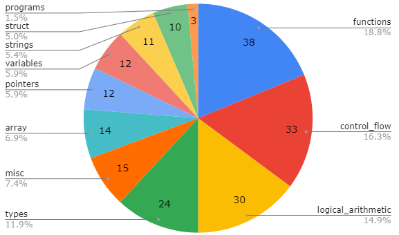

# Main coursework: A compiler for the C language

**Your program should read C source code from a given file and write corresponding RISC-V assembly to another given file.**

## Environment
[How to set up your environment?](./environment_guide.md)

## Program build and execution

Your program should be built by running the following command in the top-level directory of your repo:

```console
> root@host:/workspaces/langproc-YYYY-cw-XXX# make build/c_compiler
```

The compilation function is invoked using the flag `-S`, with the source file and output file specified on the command line:

```console
> root@host:/workspaces/langproc-YYYY-cw-XXX# build/c_compiler -S [source-file.c] -o [dest-file.s]
```

You can assume that the command-line (CLI) arguments will always be in this order, and that there will be no spaces in source or destination paths.
Note that the provided starting point in this repository already functions as specified above, so these CLI arguments should work out of the box (unless you decide not to use the provided base compiler).

## Developing your compiler

If you wish to use C++, then a basic framework for building your compiler has been provided.
You are strongly recommended to check out its structure [here](./basic_compiler.md).
Its source and header files can be found in the [src/](../src) and [include/](../include) directories respectively.

You can test your compiler by running [`./test.py`](../test.py) from the top of this repo.
The output should look as follows:

```console
> root@host:/workspaces/langproc-YYYY-cw-XXX# ./test.py
Building compiler...
[...]

tests/types/unsigned.c: Error when compiling with `build/c_compiler -S tests/types/unsigned.c -o build/output/types/unsigned/unsigned.s`, see
        build/output/types/unsigned/unsigned.c_compiler.stdout.log
        build/output/types/unsigned/unsigned.c_compiler.stderr.log

Processing coverage data...
Passed 1/86 found test cases
```

You can also run with different levels of output detail with [`./test.py --verbosity N`](../test.py).
2 is the default but 1 is used for the shortcut `Ctrl+Shift+B` in VS Code.


The provided starting framework is only able to compile a very simple program, as described [here](./basic_compiler.md).
By default, only the first [`_example/example.c`](../tests/_example/example.c) test should be passing.

Full usage guide of [`test.py`](../test.py) is found in the file header or after running `./test.py --help`.
At the time this doc was written, the output was:

```console
> root@host:/workspaces/langproc-YYYY-cw-XXX# ./test.py --help
usage: test.py [-h] [-v] [-j [N]] [--verbosity {0,1,2,3}] [--clean] [--optimise] [--report] [--validate_tests] [dir]

positional arguments:
  dir                   (Optional) paths to the compiler test folders. Use this to select certain tests. Leave blank to run all tests.

options:
  -h, --help            show this help message and exit
  -v, --version         show program's version number and exit
  -j [N], --jobs [N]    Build compiler and run tests using multiple threads. Use -m to use the default thread count, or -m N to use exactly N threads.
  --verbosity {0,1,2,3}
                        Disable verbose output into the terminal. Note that all logs will be stored automatically into log files regardless of this option.
  --clean               Clean the repository before testing. This will make it slower but it can solve some compilation issues when source files are deleted.
  --optimise            Optimise the compiler for speed, at the cost building time and debugging.
  --report              Generate a JUnit report to use as a test summary for CI/CD.
  --validate_tests      Use GCC to validate tests instead of testing the compiler. Use it to validate tests you add (see docs/coverage.md for useful tests).
```

## Input

The input file will be pre-processed [ANSI C](https://en.wikipedia.org/wiki/ANSI_C), also called C90 or C89.
It is what is generally thought of as "classic" or "normal" C, but not the _really_ old one without function prototypes (you may have never even come across that).
C90 is still often used in embedded systems, and pretty much the entire [Linux kernel](https://github.com/torvalds/linux) is written in C90.

You have mainly been taught C++, but you are probably aware of C as a subset of C++ without classes, which is a good mental model.
Your programs (lexer, parser and compiler) will never be given code that has different parsing or execution semantics under C and C++ (so, for example, you will not be given code that uses `class` as an identifier).

The source code will not contain any compiler-specific or platform-specific extensions.
If you pre-process a typical program (see later), you will see many things such as `__attribute__` or `__declspec` coming from the system headers.
You will not need to deal with any of these.

The test inputs is a set of `.c` files of increasing complexity and variety, without any errors (e.g. syntax and semantic), so your code does not need to handle these gracefully.

## Getting started

We strongly recommend that you start working on your compilers coursework straight after finishing the lab exercises, to have the time to implement a good number of features.
To get started, you are strongly recommend to get familiar with the code in the repository already and how it handles a simple program like `tests/_example/example.c`:

```
int f() {
    return 5;
}
```

Think about what kind of information is captured here, and what sort of classes are used.
You might even find drawing the AST by hand help you better understand what is really happening behind the scenes.
Make sure to benefit from the provided skeleton code and use the online resources that are linked.

Don't worry if you find it difficult to get started or feel a little overwhelmed at first, this is perfectly normal - it often takes over a week to even get basic programs to compile.
Once you have a good base, you will find it much easier (and hopefully enjoyable) to add a lot more features - although you will face more challenges when you get to more advanced features.
If you get stuck, you can always post on [Ed](https://edstem.org/us/dashboard) or ask the TAs during the lab sessions!
You are advised to try your best - the more you try the more you will learn and get out of this project (and in our unbiased opinion it is the most fun coursework you will do during your degree). However, don't sacrifice all of your other modules to try and chase the 100% score!

## Features

You are advised to implement basic features first, which include:

* functions with no arguments
* local variables of `int` type
* arithmetic and logical expressions
* `if`-then-`else` statements
* `while` loops

Supporting the above should allow you to compile a [simple, yet interesting program](https://en.wikipedia.org/wiki/Collatz_conjecture) like below:

```C
int f() {
    int n = 10;
    int k = 0;

    while (n > 1) {
        if (n % 2)
            n = 3 * n + 1;
        else
            n = n / 2;
        k++;
    }

    return k;
}
```

Once the basic features are working, you should implement intermediate features which include:

* `for` loops
* `switch` statements
* the `break` and `continue` keywords
* the `enum` keyword
* ternary operator (`x ? y : z`)
* function calls
* functions with up to 8 parameters
* recursive function calls
* arrays declared globally (i.e. outside of any function in your file)
* arrays declared locally (i.e. inside a function)
* array initialization
* reading and writing elements of an array (index can be a constant, a variable or an expression)

Once the intermediate features are working, you should implement advanced features which include:

* variables of `double`, `float`, `char`, `unsigned`, and pointer types
* calling externally-defined functions (i.e. the file being compiled declares a function, but its definition is provided in a different file that is linked later on)
* functions with more than 8 parameters
* mutually recursive function calls
* locally scoped variable declarations (e.g. a variable that is declared inside the body of a while loop, such as `while(...) {int x = ...;}`).
* the `typedef` keyword
* the `sizeof(...)` function (which takes either a type or a variable)
* taking the address of a variable using the `&` operator
* dereferencing a pointer-variable using the `*` operator
* pointer arithmetic
* character literals, including escape sequences like `\n`
* strings (as NULL-terminated character arrays)
* structs

Your compiler will be assessed using test inputs that exercise the above features.
No feature not listed above will be tested.
Here is a (partial) list of features that will not be tested:

* multithreading
* the `goto` keyword
* macros and other preprocessing directives
* the comma operator (for sequencing within expressions)
* the [old K&R style of declaring functions](https://stackoverflow.com/a/18820829)
* union types
* variable-length arrays (C90 forbids them)
* variadic functions
* the `const` keyword
* function pointers
* both implicit and explicit casting
* the `extern` keyword (handling externally-defined functions is a part of the advanced features, but `extern` is not used for that)
* the `short` and `long` types (correct width handling is tested with `float` and `double`)
* the `void` type is not tested explicitly, but it appears in some helper functions in the test cases, so your compiler cannot break when it encounters this keyword
* the `static` keyword
* standard library support (e.g. `printf(...)` from `<stdio.h>` header)
* heap-allocation: follows from "standard library support", any system call functions typically used in heap-memory allocation/deallocation like `malloc`, `calloc`, `realloc`, `free`

## Test cases

All test inputs will be valid; that is, you can assume the absence of programmer errors like syntax faults, type mismatches, and array out-of-bounds errors.
The entire compilation and testing process (including compilation, assembly, linking, and RISC-V simulation) is expected to complete within reasonable time and is expected not to use an inordinate amount of memory or disk space.

**There is no requirement for the generated assembly to be optimised in any way - the only requirement is that your compiler produces the correct answer.**

The [tests](../tests) contains a large number of example inputs, divided into various categories, that you might like to use as testcases.
Your compiler will be assessed on these "seen" inputs together with a further set of "unseen" inputs that are of a similar form.
It is worth emphasising that it is not expected that many compilers will correctly compile all of the "seen" inputs (let alone the "unseen" ones!).

The split between test cases can be seen below.
Do not assume it will stay exactly like this, but you can use it as a rough estimate of what to focus on in case you are running short on time.
**Remember that tests for advanced features will also test basic features, so you should implement the basic features first (e.g. without working functions the array tests will fail).**



## Output Format

The output format should be RISC-V assembly code, which can be assembled and linked against a C run-time, and which executes correctly on a RISC-V processor as emulated by `spike`.

Given a test case `test.c` and its driver `test_driver.c`, your compiler will be used like:

```console
> root@host:/workspaces/langproc-YYYY-cw-XXX# build/c_compiler -S test.c -o test.s
```
GCC will be used to assemble `test.s` into object file `test.o` like:

```console
> root@host:/workspaces/langproc-YYYY-cw-XXX# riscv32-unknown-elf-gcc -march=rv32gc -mabi=ilp32d -c test.s -o test.o
```
GCC will be also used to link `test.o` with the driver `test_driver.c` into executable `test` like:

```console
> root@host:/workspaces/langproc-YYYY-cw-XXX# riscv32-unknown-elf-gcc -march=rv32gc -mabi=ilp32d -static test.o test_driver.c -o test
```
`spike` will be used to simulate the executable `test` on RISC-V processor like:

```console
> root@host:/workspaces/langproc-YYYY-cw-XXX# spike --isa=rv32gc pk test
```

The last command should produce an exit code `0`, which can be verified immediately after running the command like so:

```console
> root@host:/workspaces/langproc-YYYY-cw-XXX# echo $?
0
```

## Useful links
* [Godbolt](https://godbolt.org/z/8avTcnr9E) - Great tool for viewing what GCC compiler would produce for a given snippet of C code.
  This link is pre-configured for the correct architecture (`RV32GC`) and ABI (`ILP32D`) that the coursework targets.
  Code optimisation is also disabled to best mimic what you might want your compiler to output.
  You can replicate Godbolt locally by running `riscv32-unknown-elf-gcc -std=c90 -pedantic -ansi -O0 -march=rv32gc -mabi=ilp32d -S [source-file.c] -o [dest-file.s]`.

* [Interactive RISC-V simulator](https://creatorsim.github.io/creator) - Might be helpful when trying to work out the behaviour of certain instructions that Godbolt emits.

* [RISC-V ISA](https://docs.riscv.org/reference/isa/unpriv/unpriv-index.html) - Instruction Set Manual - you should only be generating assembly using instructions from the I, M, F, and D sections.

* [RISC-V ABI](https://github.com/riscv-non-isa/riscv-elf-psabi-doc/blob/9a77e8801592b3d194796ea5ba6ec670e4fe054f/riscv-cc.adoc) - Calling conventions for registers and functions depending on their types.
  It is expected that certain registers will contain the same value before and after making a function call.
  Additionally, it is expected that function arguments are passed in a certain order - so pay careful attention to the standard ABI called [`ILP32D`](https://github.com/riscv-non-isa/riscv-elf-psabi-doc/blob/9a77e8801592b3d194796ea5ba6ec670e4fe054f/riscv-cc.adoc#abi-ilp32d) with `XLEN` of 32.

## Assembler directives
[What even is `.data`, `.text`, or `.word`? You will need to consider assembler directives in your output](./assembler_directives.md)

## Adding meaningful tests
[Do you want to add a test that is actually demonstrating you compiler features like no provided test does?](./coverage.md)

## Debugging
[Do you want to know which tools you can use to help you solve bugs?](./debugging.md)

## Compiler extensions
[Have you finished your compiler and you are looking for possible extensions?](./extension_ideas.md)

## Plagiarism and AI use

One final thing, please don't copy any existing solutions from previous years you find online.
In previous years we had quite a few groups do this and unsurprisingly they were all caught (some of us have been checking this coursework for 5+ years and have seen most of the solutions online), and although you are targeting a different ISA compared to some years ago, there is still a lot you can copy as code generation is just one (arguably easier) part of the coursework.
It can be fine to look at these solutions to get ideas on how to make high-level decisions like AST structure, but make sure you actually write the code yourself.
The same goes for using LLMs (a.k.a. AI chatbots like ChatGPT) -- if you want, use them to your advantage for debugging or prototyping, but be aware of blindly implementing a different compiler than you have been asked for or copying a solution that will get flagged for similarity with other solutions found online (as you know, LLMs simply learns from what is out there on the Internet).
Remember that while it might look daunting at first, this coursework has been successfully completed by many generations of students before you, without access to LLMs and in significantly more difficult world circumstances, like lockdowns and pandemics.

Good luck!
