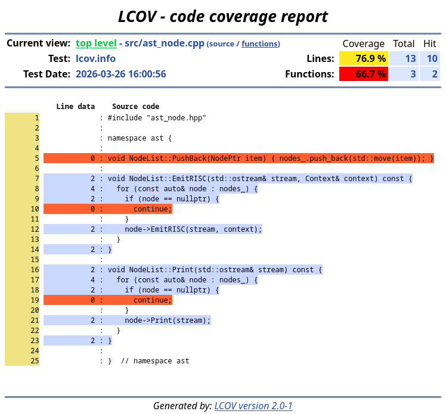

# Coverage information

If you want to know which part of your code is executed when running all tests, use `test.py` without the `--optimise` flag.

This will generate a webpage `coverage/index.html` with a listing of all the source files and for each source file a listing of the number of times each line has been executed.
VS Code will also display a warning on lines not covered.

To know which lines are covered by a single test, first make sure your compiler is built without optimisations (if you used the `--optimise` or `make` without `DEBUG=1`, or if you are unsure, run `make clean && make DEBUG=1`).
Then run your compiler on a file (`build/c_compiler -S <test_file.c> -o <whatever>`).
Finally run `make DEBUG=1 coverage` to generate the coverage webpage and update the covered lines in VS Code.

## Viewing the coverage webpage

You can view the webpage in your browser by copying the link printed by `test.py` in your browser or the in VS Code integrated browser by first typing `>workbench.action.browser` in the top bar (Ctrl+P).